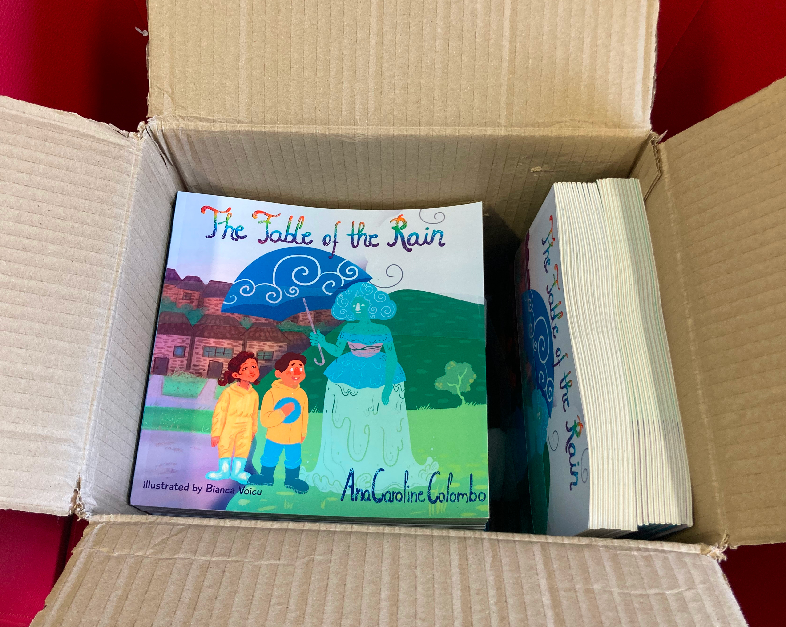

It is official, I’m a children’s book author! 

Last week was the launch of my book 'The Fable of the Rain'. It was an [online event](https://twitter.com/acarolcolombo/status/1565278541465456642?s=20&t=MnEM-RL2NggyLIsGH_8S_w) including cover revelation, voxpop about the book, and link for purchase. I couldn´t concentrate on my work that day. It isn´t everyday that you launch your first book. 

Yesterday, I got the printed version. What an incredible moment to see my ideas becoming real on paper. Not environmentally friendly but for a children’s book, it is a must. 

The book was a result of a creative writing course organised by [Writing on the Wall (WoW)](https://writingonthewall.org.uk/) that I did while I was at home being exclusively a mum (which I know is a privilege!). It was truly an opportunity to rediscover myself and check off a buckelist item. 

This wouldn´t be possible without WoW and great mentoring from [Yvonne Battle-Felton](https://www.yvonnebattlefelton.com/) and illustrations by [Bianca Voicu](https://www.instagram.com/biancav_art/)! 

The inspiration came from playing with my daughter Yara and rethinking about my own childhood. This book reflects on how changing perspectives can bring solutions.

**What is the book about?**

What would you do if it was raining on the day of your picnic birthday party? Naya found the solution after hearing a fable in which the rain disappeared. A story about appreciating diversity (and all of the weather).

**Interested?**

You can buy the **printed version** on WoW website here: [https://bit.ly/3RQaFvw](https://bit.ly/3RQaFvw)
 
*(You don’t need to live in the UK to purchase it. They will ship anywhere in the world.)*

Soon in some bookshops in Liverpool
 
*(More details coming soon.)*

The **kindle version** is available on Amazon.
 
UK: [https://amzn.to/3qoQqtj](https://amzn.to/3qoQqtj)
 
BR: [https://amzn.to/3xfzZTL](https://amzn.to/3xfzZTL)
 
US: [https://amzn.to/3B4gQoY](https://amzn.to/3B4gQoY)

