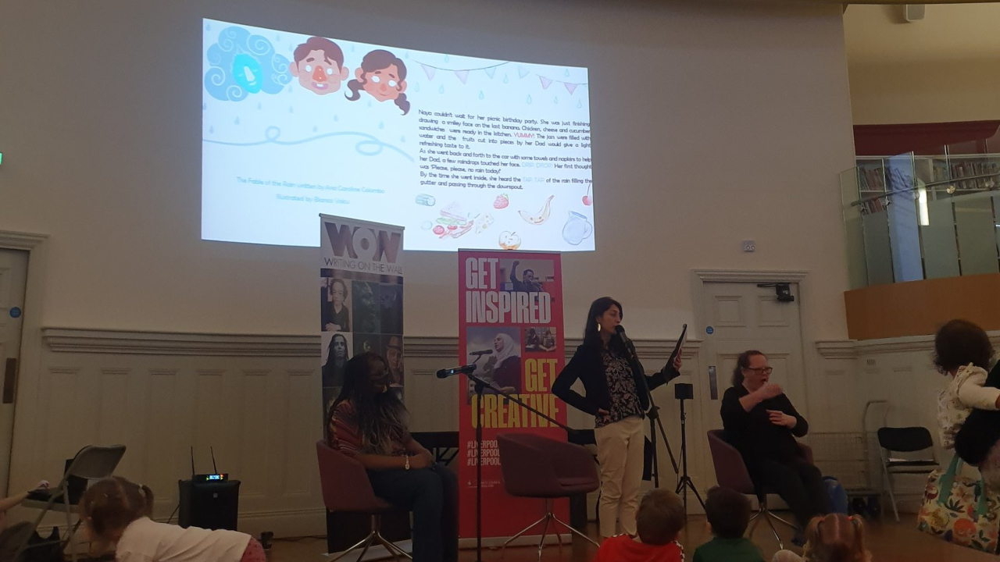

On 28th February, I had the pleasure to read my children's book "The Fable of the Rain" in the Children's Library at [Liverpool Central Library](https://liverpool.gov.uk/libraries/find-a-library/central-library/) during the [Liverpool Year of Writing Celebration event](https://twitter.com/acarolcolombo/status/1496956461649481737?s=20&t=7tyiaj4jth4Na82uwheQ2Q). During the performance, the kids heard the story while watching the amazing illustrations of the book created by [Bianca Voicu](https://www.linkedin.com/in/bianca-voicu-8309411a2/) on a screen. Hard to describe in words the anxiety before the performance and the fulfilment that came afterwards. It's never late to try news things!

This book was a result of the work developed during the [Write What's Next mentoring course](http://writingonthewall.org.uk/wwn-ybf/) organised by [Writing on the Wall](https://writingonthewall.org.uk/). 

My mentor was the incredible [Yvonne Battle-Felton](https://www.yvonnebattlefelton.com/) who inspired creativity, and empowered confidence and collaboration. I met two other inspiring writers during the course, [Jennifer Khalil](https://twitter.com/JenniferKhalil7?s=20&t=Fb1ElowSVzafTtHfxieLAw) and [Elizabeth Ryan](https://twitter.com/Lizryan99?s=20&t=Fb1ElowSVzafTtHfxieLAw). We had the opportunity to work with Sheffield Hallam Graphic Design students which was an incredible experience. This is how I met Bianca. Also, thanks to [Rebekah Krain](https://www.linkedin.com/in/rebekah-krain-9a6438195/) and [Angelica Ramos](https://www.linkedin.com/in/angelica-ramos-2a632a232/) for their amazing pitches and illustrations.

The book is still on the editing phase, but it will be launched very soon for purchase. I'll keep you posted!

