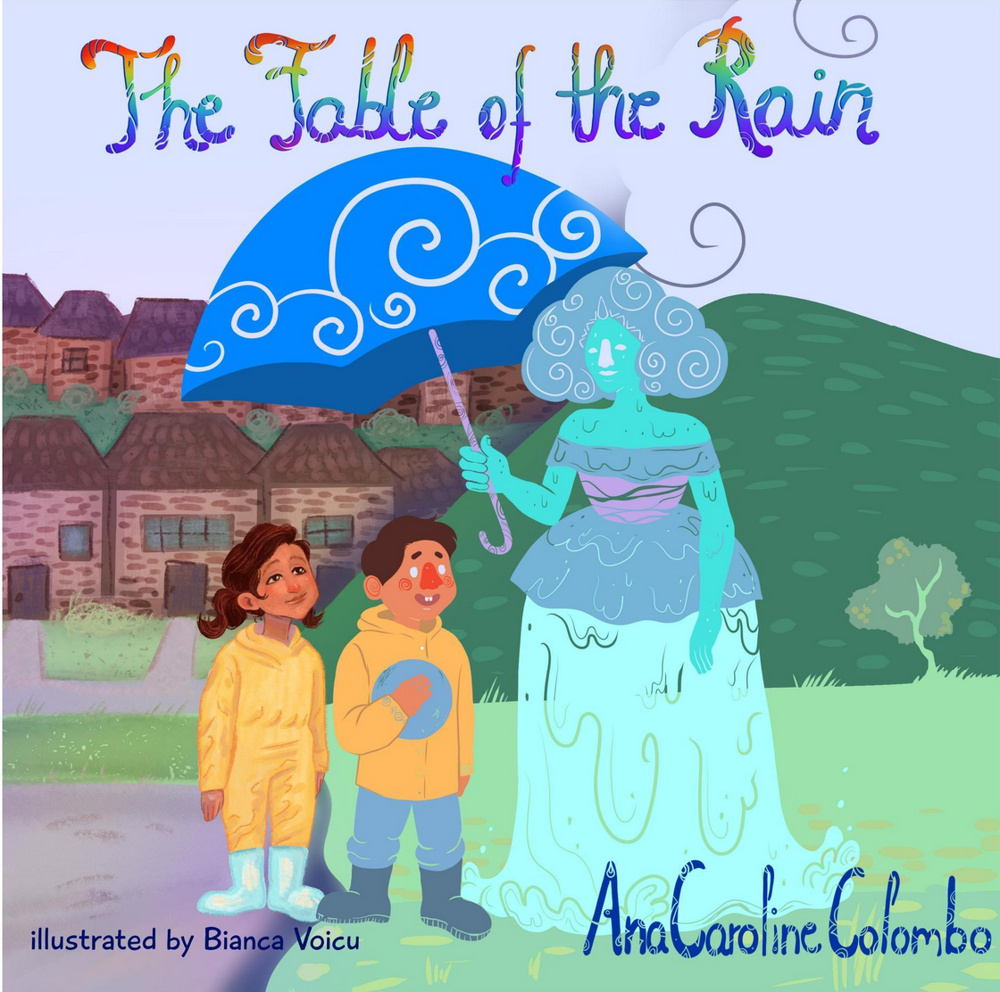

Sou brasileira e nos últimos cinco anos morei em três diferentes ilhas no exterior:
Long Island, Oahu, e Great Britain. 

Eu amo natureza; e estudei biologia.

Eu trabalhei como:
* cientista em uma laboratório onde eu usava jaleco branco e fazia experimentos científicos,
* educadora em um jardim botânico onde eu usava botas de trilha e explicava ciência para crianças,
* estagiária em uma organização não-governamental (ONG) que empodera estudantes menos favorecidos a buscarem uma carreira em
Ciência, Tecnologia, Engenharia e Matemática (STEM) onde eu contribui com a organização do programa de verão.

Atualmente, eu sou secretária de Engajamento e Divulgação da Sociedade de Biologia Experimental (SEB) onde minha principal função é organizar e executar projetos de educação científica e divulgação dentro da Sociedade e para o púlico em geral e promover diversidade, igualdade e inclusão na ciência. Eu também trabalho em projetos que auxiliam no desenvolvimento da carreira de cientistas.

Eu acredito que podemos diminuir a desigualdade através de mentoria e educação. 

Sou a autora do livro infantil ['The Fable of the Rain' ](https://www.acarolcolombo.com/news/book) (A Fábula da Chuva) com ilustrações de Bianca Voicu.

Minha jornada se emaranhou com a escrita criativa em 2021.

Eu escrevo estórias de crianças inpirada por ideias que surgem enquanto brinco com minha filha.
Minhas estórias curtas tem influências da cultura brasileira e minha experiência como cientista.

Esse site contém algumas das minhas estórias e dos meus artigos científicos.

